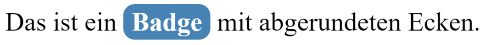
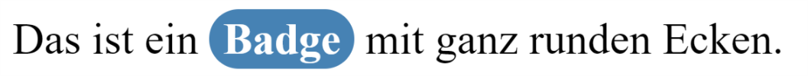
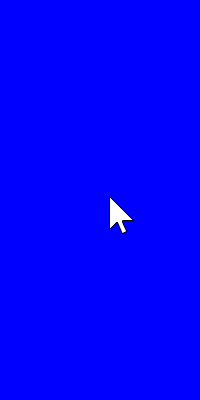
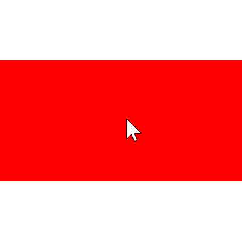

# Übungsaufgaben Cascading Stylesheets

## Einführung

Das Ziel dieses Übungskomplexes ist das Erlernen der grundlegenden Verwendung von CSS (erste Aufgaben) sowie das Kennenlernen eines CSS-Frameworks (hier: Bootstrap) und dessen Einsatz für die Gestaltung des Blogs. Nach Abschluss dieser Übungsserie steht die gestalterische Ausrichtung des Blogs fest und ist in den Klickprototypen integriert.

### Aufgabe 1

Tabelle aus vorheriger Übung gestalten

a) Ändern Sie die Darstellung der Spaltenüberschriften mittels CSS. Ändern Sie die Schriftart, die Textfarbe, Textgröße und die Hintergrundfarbe der Überschriften.

b) Stellen Sie verschiedene Arten von Lehrveranstaltungen mit unterschiedlichen Farben dar.
Verwenden Sie CSS-Klassen.

c) Experimentieren Sie mit den CSS-Eigenschaften `padding, margin, border` bei der
Darstellung der Tabelle.

### Aufgabe 2

UI-Control gestalten

Betrachten Sie den folgende HTML-Datei:

```html
#!text/html
<!DOCTYPE html>
<html>
  <head>
    <meta charset="utf-8" />
    <title>Badges</title>

    <style></style>
  </head>
  <body>
    Das ist ein <span>Badge</span> mit abgerundeten Ecken.
  </body>
</html>
```

Lösen Sie die folgenden Aufgaben so, dass mehrere Badges mit demselben Aussehen in einem Dokument vorhanden sein können. Verwenden Sie für die Lösung **nicht** das Bootstrap-Framework, sondern native CSS-Formatierungsangaben.

**a)** Formatieren Sie das `span`-Element so, dass die Ausgabe folgendermaßen aussieht:



**b)** Formatieren Sie das `span`-Element so, dass die Ausgabe folgendermaßen aussieht:



**Hinweis:** Die Höhe eines Elementes lässt sich mit CSS **nicht** bestimmen. Der Radius des Randes kann aber niemals größer als die Hälfte der Höhe angezeigt werden.

### Aufgabe 3

Transition erstellen

Betrachten Sie den folgende HTML-Datei:

```html
#!text/html
<!DOCTYPE html>
<html>
  <head>
    <meta charset="utf-8" />
    <title>Transition</title>

    <style></style>
  </head>
  <body>
    <div id="rect"></div>
  </body>
</html>
```

Formatieren Sie das `div`-Element so, dass es 100 Pixel breit, 200 Pixel hoch und blau gefärbt ist. Wenn das `div`-Element mit der Maus überfahren wird, soll sich innerhalb von zwei Sekunden dessen Hintergrundfarbe von blau auf rot ändern und die Lage um 90 Grad im Uhrzeigersinn drehen:




### Aufgabe 4

Einfaches Layout erstellen

Setzen Sie ein Layout mit `CSS-Grid` um. Betrachten Sie hierfür folgendes Video, das zwei verschiedene Stile zur Anordnung des _main content_ veranschaulicht. Zunächst sieht man die Anordnung der grünen Boxen untereinander. Anschließend werden im CSS-Code 1 bis 2 Zeilen geändert bzw. hinzugefügt, so dass man ca. bei Sekunde 40 die Anordnung der grünen Boxen nebeneinander sieht.

[Layout mit CSS-Grid](uploads/9ad63599e4123bfc50d8509b9255b33f/grid_block_flex.mp4)

Hinweise: Um diese Aufgabe schneller umzusetzen, machen Sie sich mit folgenden Begriffen vertraut:

- CSS-Grid
- display properties: block vs. flex
- overflow-y
- vh

## Blogsystem

### Aufgabe 5

Erstellen Sie eine Kopie des Verzeichnisses `uebung01` mit dem Namen `uebung02` und verwenden Sie diese Kopie für die weitere Arbeit am Blog. Machen Sie das künftig in jeder Woche.

### Aufgabe 6

Gridsystem von Bootstrap verwenden

Machen Sie sich mit dem CSS Framework [Bootstrap 4.0](https://getbootstrap.com/docs/4.0/getting-started/introduction/) bzw. [Bootstrap v5](https://getbootstrap.com/) vertraut. Verwenden Sie das Gridsystem von Bootstrap, um das Blog mit einem ansprechenden Design zu versehen. Orientieren Sie sich am Demovideo der Musterlösung.

Überlegen Sie zuerst auf einer Handskizze, wie das Gridsystem von Bootstrap genutzt werden soll (Container, Spalten und deren Breiten, Zeilen).

Bearbeiten Sie vorerst nur das Markup der Datei `index.html`. Die weiteren Dateien können Sie anpassen, sobald die folgende Aufgabe fertiggestellt ist.

### Aufgabe 7

Responsive Design mit Bootstrap

a) Gestalten Sie Ihr Layout mit Hilfe geeigneter Bootstrap-Klassen responsive, so dass es auf zwei Größenklassen verschieden dargestellt wird:

- Smartphone und kleiner: Seitenleiste unter dem Hauptinhaltsblock
- größer als Smartphone: Seitenleiste neben dem Hauptinhaltsblock

b) Übertragen Sie jetzt das Layout auf alle Dateien des Blogs.

### Aufgabe 8

Media Queries verwenden

Informieren Sie sich über [Media Queries]([https://www.w3schools.com/css/css3_mediaqueries.asp|). Überlegen Sie, wie das responsive Design aus der vorherigen Aufgabe ohne Bootstrap, nur mit Media-Queries, erreicht werden kann und implementieren Sie es beispielhaft für eine Seite.
